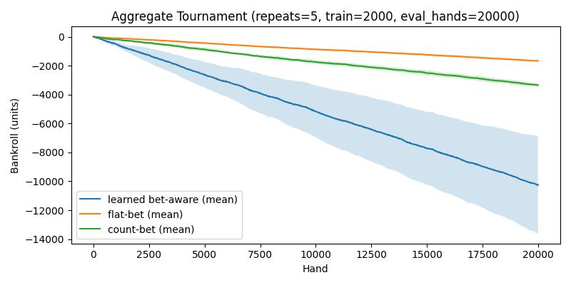

# RL-blackjack

This project contains a reinforcement learning agent to learn Blackjack and experiment with card-counting strategies using deep RL.

## Quickstart

1. Create and activate the venv (from project root `C:\Projects\RL-blackjack`):

PowerShell:
```powershell
python -m venv .venv
Set-ExecutionPolicy -Scope Process -ExecutionPolicy Bypass; .\.venv\Scripts\Activate.ps1
# or simply:
.\.venv\Scripts\Activate.ps1
```

cmd.exe:
```cmd
.\.venv\Scripts\activate.bat
```

Git Bash / Unix-like shell:
```bash
source .venv/Scripts/activate
```

2. Install project dependencies
```powershell
python -m pip install --upgrade pip setuptools wheel
python -m pip install -r requirements.txt
```

3. Suggested steps
- Add environments and an initial training script using `stable-baselines3` (PPO or DQN are good starting points).
- Add logging to TensorBoard for monitoring training progress.
- Implement environment wrappers to provide observations (counts, deck state) suitable for learning.

## Notes
- Keep source code outside of `.venv/` and add `.venv/` to `.gitignore`.
- If you have an NVIDIA GPU and want faster training, install a CUDA-enabled PyTorch build matching your CUDA driver.

---

## Getting started with this implementation ✅

- `src/blackjack/env.py`: Minimal Blackjack environment with a Hi-Lo running count and deterministic deck injection for tests.
- `src/blackjack/agent.py`: A small tabular Q-learning agent that uses a binned true count as part of the state.
- `src/blackjack/train.py`: Lightweight training loop function used by `main.py`.
- `main.py`: Quick entrypoint that runs a short training session and saves a policy `q_agent.pkl`.
- `tests/`: PyTest tests for the environment, agent update and a short integration run.

To run tests:
```bash
pip install -r requirements-dev.txt
pytest -q
```

To run the demo training:
```bash
python main.py
```

## Card-counting simulation 🔎

A small simulator is provided at `scripts/simulate_counting.py` which compares a flat-bet strategy with a simple count-based betting ramp. It runs `N` hands, tracks bankroll, and saves a plot at `plots/count_vs_flat.png`.

Example:
```bash
python scripts/simulate_counting.py --hands 10000 --seed 42 --out plots/count_vs_flat.png
```

---

## Tournament & aggregated results 📊

We ran a tournament where a **bet-aware RL agent** (learns both bet and hit/stick policy) was trained and compared to:
- A **flat-bet baseline** (fixed bet), and
- A **count-based betting** rule (simple ramp by true count).

I ran aggregate experiments across multiple seeds and plotted mean ± std of bankroll over hands. The final aggregated plot is saved in the repository and shown below:



---

## What we completed together ✅

- Implemented a minimal Blackjack environment with Hi-Lo running count (`src/blackjack/env.py`). 🔧
- Added a tabular Q-learning agent and a **bet-aware** extension (`src/blackjack/agent.py`). 🤖
- Wrote training loops (`src/blackjack/train.py`) and a small demo (`main.py`). ▶️
- Added robust tests for env, agents, training, simulation, tournament, and aggregation (`tests/`). ✅
- Built simulation tools to compare flat vs count vs learned policies and saved plots under `plots/`. 📈
- Ran full aggregate experiments (5 repeats, train=2000 episodes, eval=20000 hands) and saved the aggregated plot `plots/tournament_agg_5x2000_20k.png`.

If you'd like, I can also commit the final plot into a `docs/` directory and generate a short HTML report summarizing the numeric results.

